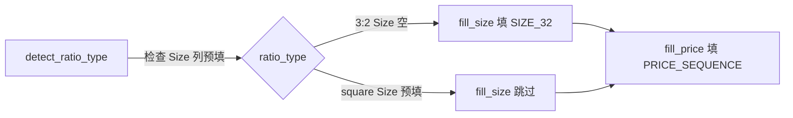

## 用户需求

### 需求背景

用户之前的需求（已实现）：支持正方形 1:1 海报表格处理，包括 Width 列填充。本次是对该实现的**纠正和补充**。

### 需求 1：纠正正方形检测方式

- **之前的方式（错误）**：扫描 Product Name 中的 `12x12`/`16x16` 等关键词判断正方形
- **正确方式**：正方形的 **Size 列是用户在 Excel 中预先填好的**（非空）；3:2 的 Size 列是空的（由脚本填充）
- 脚本应改为基于 Size 列是否预填来判断比例类型
- 正方形组的 Size 列**不能被覆盖**，保留用户预填值
- 标题后缀尺寸格式**保持不变**（继续用 `08x12inch(20x30cm)` / `12x12inch(30x30cm)` 短代码）

### 需求 2：正方形价格补全

- 正方形组的 "Your Price" 列在导出时是空的
- 脚本内置**固定价格表**（来自用户图片）：`["", 19.9, 29.9, 45, 75, 99, 11.9, 14.9, 19.9, 24.9, 34.9]`
- 对**所有组**（3:2 和正方形）都填这张表

### 不变的部分

- 11 行组结构不变
- Color、Size Map、Length、Width、Weight 等字段填充逻辑不变
- normalize_group 标题规范化逻辑不变（格式保持原短代码）
- 正方形 Width 仍留空、Length 用 LENGTH_SQUARE

## 产品概述

亚马逊 Excel 模板批量处理工具，修正正方形海报的检测方式（从关键词改为 Size 列预填检测），并新增固定价格表填充功能，确保正方形组的 Size 列和价格列正确处理。

## 核心功能

- 基于 Size 列预填状态自动检测正方形/3:2 比例
- 正方形组保留用户预填的 Size 值不被覆盖
- 对所有组填充统一的 "Your Price" 固定价格表

## Tech Stack

- Python 3.11+ / openpyxl（现有项目栈，不变）
- PyInstaller 打包（现有 build.py）
- pytest 测试（现有测试框架）

## Implementation Approach

### 核心策略

1. **检测方式改造**：`detect_ratio_type` 从扫描 Product Name 关键词改为扫描 Size 列。若 Size 列存在且任意变体行（index 1-10）有非空值 → "square"；否则 → "3:2"
2. **Size 列保护**：`fill_size` 在 ratio_type == "square" 时直接 return，不覆盖预填值
3. **价格填充**：新增 `PRICE_SEQUENCE` 常量和 `fill_price` 函数，与其他 fill 函数模式完全一致，对所有组统一填充

### 关键技术决策

- **detect_ratio_type 签名变更**：从 `(ws, rows, product_name_col)` 改为 `(ws, rows, col_map)`，因为需要访问 Size 列索引。两个调用点（`__main__.py:60` 和 `gui_entry.py:109`）同步更新
- **跳过 parent 行检测**：parent 行（index 0）的 Size 本就为空，检测时跳过，只看变体行 1-10
- **Size 列不存在时的安全降级**：若 "Size" 不在 col_map 中，默认返回 "3:2"
- **移除 SQUARE_KEYWORDS**：不再使用关键词检测，删除该常量保持代码整洁
- **PRICE_SEQUENCE 格式**：parent 行空字符串，10 个变体行对应固定价格，与 WEIGHT_SEQUENCE 等常量结构一致

### Performance & Reliability

- 检测复杂度 O(11) 每组，与原实现相同，无性能影响
- 价格填充 O(11) 每组，与其他 fill 函数一致
- 无额外 I/O 或内存开销

### Avoiding Technical Debt

- 完全复用现有 fill 函数模式（`fill_price` 与 `fill_weight` 结构对称）
- 不引入新架构模式，保持 field_filler.py 内部一致性
- 测试遵循现有 `_create_test_ws` + 独立 TestClass 模式

## Implementation Notes

### 关键执行细节

- **detect_ratio_type 调用时序**：在 `__main__.py`/`gui_entry.py` 中，`detect_ratio_type` 在 `fill_group` **之前**调用。此时 3:2 组的 Size 列仍为空（尚未填充），正方形组的 Size 列已有用户预填值。这个时序保证检测正确
- **两个入口点都要改**：`__main__.py`（CLI 入口）和 `gui_entry.py`（打包后 GUI 入口）都调用 `detect_ratio_type`，两个都要更新签名
- **fill_size 的 square 分支**：加 `if ratio_type == "square": return` 在函数开头（在 col_map 检查之后），确保不覆盖
- **PRICE_SEQUENCE 数值类型**：`45`/`75`/`99` 用整数即可，openpyxl 写入 Excel 后会正常显示

### Blast Radius Control

- 仅改 field_filler.py、excel_io.py、__main__.py、gui_entry.py、test_field_filler.py、README.md
- 不动 name_normalizer.py（标题格式不变）
- 不动 excel_io.py 的 load/save 逻辑（只加列名）
- 向后兼容：若输入文件无 "Your Price" 列，fill_price 自动跳过（`if "Your Price" not in col_map: return`）

## Architecture Design

### 当前数据流（不变）

```
load_workbook → locate_columns → group_rows → [detect_ratio_type → normalize_group → fill_group] × N → save_workbook
```

### 修改点在 detect_ratio_type 和 fill_group 内部

- `detect_ratio_type`：输入从 `product_name_col` 变为 `col_map`，检测目标从 Product Name 变为 Size 列
- `fill_group`：新增 `fill_price` 调用，`fill_size` 对 square 跳过



## Directory Structure

```
src/amazon_excel_processor/
├── field_filler.py          # [MODIFY] 核心改动：detect_ratio_type 改签名+逻辑、fill_size 加 square 跳过、新增 PRICE_SEQUENCE+fill_price、fill_group 加调用、删 SQUARE_KEYWORDS
├── excel_io.py              # [MODIFY] OPTIONAL_COLUMNS 加 "Your Price"
├── __main__.py              # [MODIFY] 第60行 detect_ratio_type 调用签名改为 (ws, rows, col_map)
├── gui_entry.py             # [MODIFY] 第109行 detect_ratio_type 调用签名改为 (ws, rows, col_map)
├── name_normalizer.py       # [不动] 标题格式保持原短代码
└── __init__.py              # [不动]

tests/
└── test_field_filler.py     # [MODIFY] _create_test_ws 加 Your Price 列、TestDetectRatioType 改为 Size 列检测、TestFillSize 正方形用例改为验证保留预填值、新增 TestFillPrice

README.md                    # [MODIFY] 更新检测逻辑描述、字段表加 Width 和 Your Price
```

## Key Code Structures

### detect_ratio_type 新签名和逻辑

```python
def detect_ratio_type(ws: Worksheet, rows: list[int], col_map: dict[str, int]) -> str:
    """检测产品组的比例类型。基于 Size 列是否预填判断。"""
    if "Size" not in col_map:
        return "3:2"
    size_col = col_map["Size"]
    for i, row in enumerate(rows):
        if i == 0:  # 跳过 parent 行
            continue
        value = ws.cell(row=row, column=size_col).value
        if value is not None and str(value).strip():
            return "square"
    return "3:2"
```

### PRICE_SEQUENCE 常量

```python
PRICE_SEQUENCE = ["", 19.9, 29.9, 45, 75, 99, 11.9, 14.9, 19.9, 24.9, 34.9]
```

## Agent Extensions

### Skill

- **test-driven-development**
- Purpose: 在更新测试时先编写失败的测试用例（detect_ratio_type 新签名、fill_size 保留预填值、fill_price 填充），再验证实现使其通过
- Expected outcome: 所有新增和修改的测试用例通过，覆盖正方形检测、Size 保留、价格填充三条路径

- **verification-before-completion**
- Purpose: 在声称完成前运行全部测试和打包验证，确认 30+ 测试全绿且 dist 产物正常生成
- Expected outcome: pytest 全通过、build.py 成功生成 dist/amazon-excel-processor